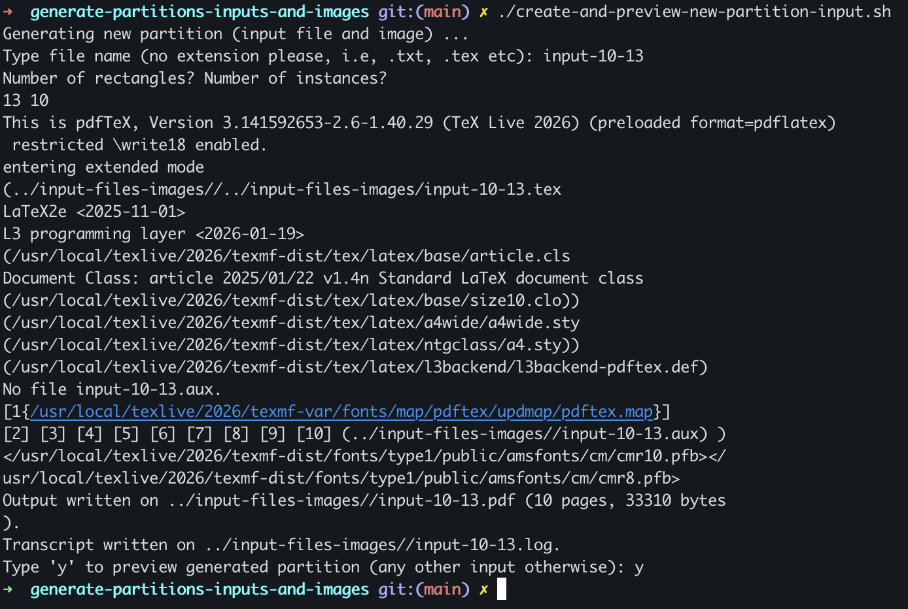
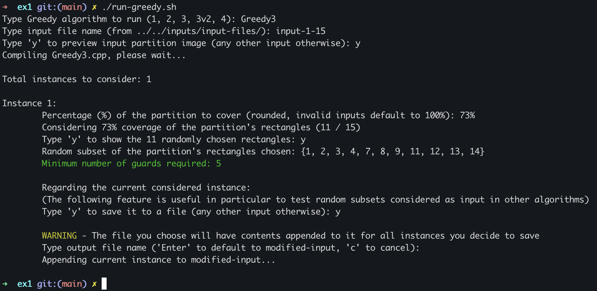
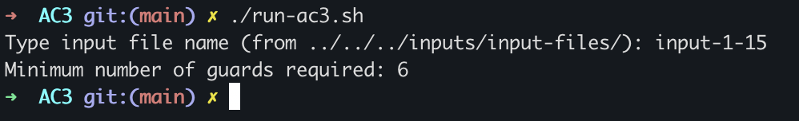
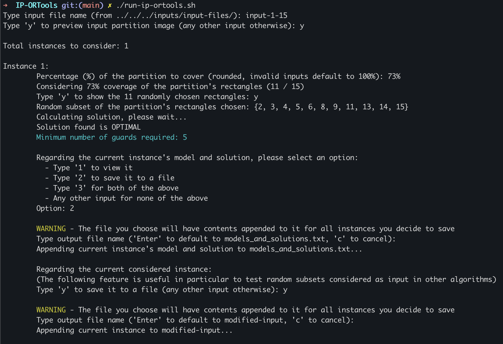

# README

This README guides you through executing the project and its scripts.

This project includes several `.sh` scripts to simplify running the algorithms with a chosen input from the `inputs/input-files/` directory.

If you encounter a `Permission denied` error when executing any script, run:

```
chmod +x run-greedy.sh
```

<br>

## Generate inputs files and images

The project already includes several input files (used in the report), along with their corresponding images for instances of size ≤ 50.

Additionally, the directory `inputs/generate-partitions-inputs-and-images/` provides a script  which allows you to generate new input files and their corresponding images. To create a new instance, simply run:


```
./create-and-preview-new-partition-input.sh
```


The execution should look as follows:
<br></br>


After running the script, you will be prompted with the following inputs:
1. **File name** – Choose a name without an extension, as it will be used for both the input file and the generated image. Our naming convention follows the format `input-x-y`, where `x` represents the number of instances and `y` the number of rectangles per partition.
2. **Number of rectangles and instances** – It is recommended to follow the same convention used in the file name for consistency.
3. **Preview generated input file** – Enter `y` if you wish to preview the generated partition and its corresponding image.


<br>

## Exercise 1 - Greedy Algorithms

The folder `src/ex1/` contains all of our greedy algorithms. 

To execute one of them, simply run:

```
./run-greedy.sh
```

The execution should look as follows:




After running the script, you will be prompted with the following inputs:

1. **Greedy to run** – Enter the number corresponding to the desired algorithm (as shown in parentheses, without the `.cpp` extension).
2. **Input file name** – The file must be located in the `inputs/input-files/` directory.
3. **Preview input file image** – Enter `y` if you wish to preview the partition(s) included in the input.
4. **Partition percentage to cover** – Specify the percentage of the partition to cover (default is 100%). Rectangles are selected randomly.
5. **Preview selected rectangles** – If a percentage different from 100% was chosen, you may enter `y` to preview the randomly selected subset. Otherwise, this option will not appear.
6. **Save instance to file** – Option to save the current instance. This is particularly useful when working with a random subset, allowing you to reuse the same selection across different algorithms for comparison. During this process, a file with the name according to the user's input will be added under the `inputs/input-files/` directory to easen the process for step 2.

<br>

## Exercise 2 - OR-Tools and AC-3 Algorithms

The folder `src/ex2/` contains all of our AC-3 IP OR-Tools and CP OR-Tools algorithms. 

To execute the AC3 of them, simply run:

```
./run-ac3.sh
```

The execution should look as follows:



After running the script, you will  only be prompted with the input file name.

To execute the IP_ORTools, simply run:

```
./build.sh 
./run-ip-ortools.sh
```

The execution should look as follows:



After running the script, you will be prompted with the following inputs:
1. **Input file name** – The file must be located in the `inputs/input-files/` directory.
2. **Preview input file image** – Enter `y` if you wish to preview the partition(s) included in the input.
3. **Partition percentage to cover** – Specify the percentage of the partition to cover (default is 100%). Rectangles are selected randomly.
4. **Preview selected rectangles** – If a percentage different from 100% was chosen, you may enter `y` to preview the randomly selected subset. Otherwise, this option will not appear.
5. **Preview and / or save instance model** - Option to preview and / or save current instance model to a file. Useful to understand which variables and equations are being taken into consideration.
6. **Save instance to file** – Option to save the current instance. This is particularly useful when working with a random subset, allowing you to reuse the same selection across different algorithms for comparison. During this process, a file with the name according to the user's input will be added under the `inputs/input-files/` directory to easen the process for step 2.

To execute the CP OR-Tools, go to the corresponding folder, and simply run:

```
rm -rf build
mkdir build
cd build
cmake ..
make
./main "../../../../inputs/input-files/input-3-15"
```

<br>

## Exercise 4 - Extensions

The folder `src/ex4/` contains the IP OR-Tools and CP OR-Tools algorithms for the coloring extension.

To execute the OR-Tools algorithms, go to the corresponding folder, and simply run:

```
rm -rf build
mkdir build
cd build
cmake ..
make
./main "../../../../inputs/input-files/input-3-15"
```
